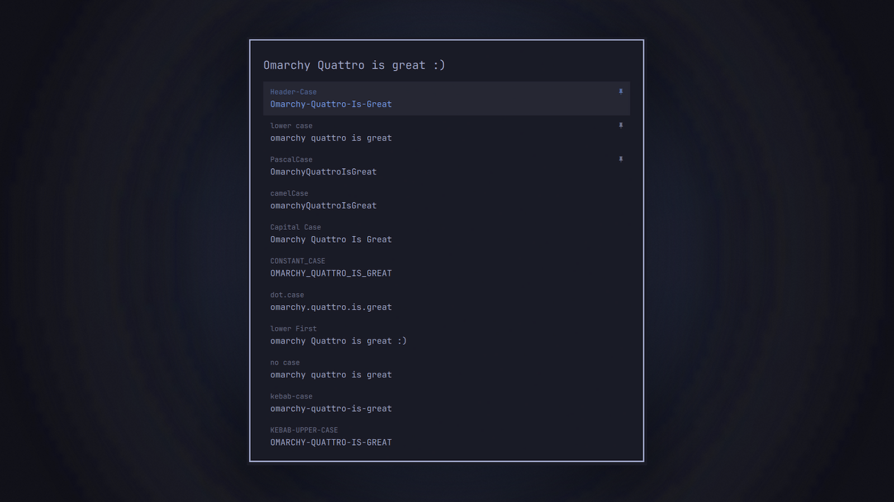

# Okata

Transform text between 21 cases and copy the result — a change-case overlay for the Omarchy shell.



## Install

```sh
omarchy plugin add https://github.com/ussego/okata.git --enable
```

Then restart the shell so it picks up the plugin:

```sh
omarchy restart shell
```

## Usage

Summon the overlay and type — every case row updates live as you type:

```sh
omarchy-shell shell summon ussego.okata
```

- Type in the input at the top to transform the text into all 21 cases at once.
- Press Enter or click a row to copy that row's result to the clipboard and close.
- Up/Down (PageUp/PageDown) move the selection; Esc clears the input (or closes), clicking the backdrop closes.
- Right-click a row to pin/unpin it at the top; pins persist between sessions.

Included cases: camelCase, Capital Case, CONSTANT_CASE, dot.case, Header-Case, lower case, lower First, no case, kebab-case, KEBAB-UPPER-CASE, PascalCase, Pascal_Snake_Case, path/case, AlTeRnAtInG cAsE, rAndOm cAsE, Sentence case, snake_case, sWAP cASE, Title Case, UPPER CASE, Upper first.

### IPC

```sh
omarchy-shell shell summon ussego.okata '{"text":"hello world"}'
omarchy-shell shell hide ussego.okata
omarchy-shell shell toggle ussego.okata
```

Payload: `{"text": "..."}` pre-fills the input.

### Keybinding

Add to `~/.config/hypr/bindings.lua`:

```lua
o.bind({ "SUPER", "SHIFT" }, "c", function()
  omarchy_shell("shell summon ussego.okata")
end)
```
